# vGhetto Automated vSphere with Kubernetes Lab Deployment

## Table of Contents

* [Description](#description)
* [Changelog](#changelog)
* [Requirements](#requirements)
* [FAQ](#faq)
* [Configuration](#configuration)
* [Logging](#logging)
* [Sample Execution](#sample-execution)
    * [Lab Deployment Script](#lab-deployment-script)
    * [Enable Workload Management](#enable-workload-management)
    * [Create Namespace](#create-namespace)
    * [Deploy Sample K8s Application](#deploy-sample-k8s-application)
    * [Deploy Tanzu Kubernetes Cluster](#deploy-tanzu-kubernetes-cluster)
    * [Network Topology](#network-topology)

## Description

Similar to other "vGhetto Lab Deployment Scripts" (such as [here](https://www.virtuallyghetto.com/2016/11/vghetto-automated-vsphere-lab-deployment-for-vsphere-6-0u2-vsphere-6-5.html), [here](https://www.virtuallyghetto.com/2017/10/vghetto-automated-nsx-t-2-0-lab-deployment.html) and [here](https://www.virtuallyghetto.com/2018/06/vghetto-automated-pivotal-container-service-pks-lab-deployment.html)), this script makes it very easy for anyone with VMware Cloud Foundation 4 licensing to deploy vSphere with Kubernetes in a Nested Lab environment for learning and educational purposes. All required VMware components (ESXi, vCenter Server, NSX Unified Appliance and Edge) are automatically deployed and configured to allow enablement of vSphere with Kubernetes. For more details about vSphere with Kubernetes, please refer to the official VMware documentation [here](https://docs.vmware.com/en/VMware-vSphere/7.0/vmware-vsphere-with-kubernetes/GUID-21ABC792-0A23-40EF-8D37-0367B483585E.html).

Below is a diagram of what is deployed as part of the solution and you simply need to have an existing vSphere environment running that is managed by vCenter Server and with enough resources (CPU, Memory and Storage) to deploy this "Nested" lab. For a complete end-to-end example including workload management enablement (post-deployment operation) and the deployment of a Tanzu Kubernetes Grid (TKG) Cluster, please have a look at the [Sample Execution](#sample-execution) section below.

You are now ready to get your K8s on! 😁

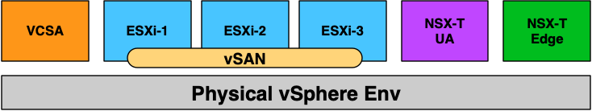

## Changelog

* **04/13/2020**
  * Initial Release

## Requirements
* vCenter Server running at least vSphere 6.7 or later
    * If your physical storage is vSAN, please ensure you've applied the following setting as mentioned [here](https://www.virtuallyghetto.com/2013/11/how-to-run-nested-esxi-on-top-of-vsan.html)
* Resource Requirements
    * Compute
        * Ability to provision VMs with up to 8 vCPU
        * Ability to provision up to 116-140 GB of memory
    * Network
        * Single Standard or Distributed Portgroup (Native VLAN) used to deploy all VMs
            * 6 x IP Addresses for VCSA, ESXi, NSX-T UA and Edge VM
            * 5 x Consecutive IP Addresses for Kubernetes Control Plane VMs
            * 1 x IP Address for T0 Static Route
            * 32 x IP Addresses (/27) for Egress CIDR range is the minimum (must not overlap with Ingress CIDR)
            * 32 x IP Addresses (/27) for Ingress CIDR range is the minimum (must not overlap with Egress CIDR)
            * All IP Addresses should be able to communicate with each other
    * Storage
        * Ability to provision up to 1TB of storage

        **Note:** For detailed requirements, plesae refer to the official document [here](https://docs.vmware.com/en/VMware-vSphere/7.0/vmware-vsphere-with-kubernetes/GUID-B1388E77-2EEC-41E2-8681-5AE549D50C77.html)

* [VMware Cloud Foundation Licenses](https://docs.vmware.com/en/VMware-vSphere/7.0/vmware-vsphere-with-kubernetes/GUID-9A190942-BDB1-4A19-BA09-728820A716F2.html)
* Desktop (Windows, Mac or Linux) with latest PowerShell Core and PowerCLI 12.0 Core installed. See [ instructions here](https://blogs.vmware.com/PowerCLI/2018/03/installing-powercli-10-0-0-macos.html) for more details
* vSphere 7 & NSX-T OVAs:
    * [vCenter Server Appliance 7.0 Build 15952498](https://my.vmware.com/web/vmware/details?downloadGroup=VC700&productId=974&rPId=45006)
    * [NSX-T Unified Appliance 3.0 OVA - Build 15946738](https://my.vmware.com/group/vmware/details?downloadGroup=NSX-T-300&productId=982&download=true&fileId=35e89f7fce7f0681258656c9b16ebc5d&secureParam=3e43a22a12477bcae462c37d09677dd2&uuId=724599c8-41c9-47ca-8995-eda318eda20e&downloadType=)
    * [NSX-T Edge 3.0 OVA - Build 15946738](https://my.vmware.com/group/vmware/details?downloadGroup=NSX-T-300&productId=982&download=true&fileId=7ca3ab9202b39d92b805d5414628215a&secureParam=833ac1e89d29baa2c62c274d5fc072f7&uuId=f79fbe81-d12e-4403-b0c5-e8f76aa5621e&downloadType=)
    * [Nested ESXi 7.0 OVA - Build 15344619](https://download3.vmware.com/software/vmw-tools/nested-esxi/Nested_ESXi7.0_Appliance_Template_v1.ova)

## FAQ

1) What if I do not have a VMware Cloud Foundation 4 License?
    * You can purchase a VMUG Advantage membership which gives you access to all the latest VMware solutions including VCF 4.0. There is also a special [VMUG Advantage Homelab Group Buy with an additional 15% discount](https://www.virtuallyghetto.com/2020/04/special-vmug-advantage-homelab-group-buy.html) that you can take advantage of right now!

2) Can I reduce the default CPU, Memory and Storage resources?

    * You can, but it is highly recommended to leave the current defaults for the best working experience. For non-vSphere with Kubernetes usage, you can certainly tune down the resources. For vSphere Pod usage, it is possible to deploy the NSX-T Edge with just 4 vCPU, however if you are going to deploy TKG Clusters, you will need 8 vCPUs on the NSX-T Edge for proper functionality. For memory resources, you can reduce the ESXi VM memory to 16GB but if you intend to deploy K8s application/workloads, you will want to keep the default. For NSX-T memory, I have seen cases where system will become unresponsive and although you can probably tune it down a bit more, I would strongly suggest you keep the defaults unless you plan to do exhaustive testing to ensure there is no negative impact.

3) Can I just deploy vSphere (VCSA, ESXi) and vSAN without NSX-T and vSphere with Kubernetes?

    * Yes, simply search for the following variables and change their values to `0` to not deploy NSX-T components or run through the configurations

        ```
        $setupPacificStoragePolicy = 0
        $deployNSXManager = 0
        $deployNSXEdge = 0
        $postDeployNSXConfig = 0
        $setupPacific = 0
        ```

4) Can I just deploy vSphere (VCSA, ESXi), vSAN and  NSX-T but not configure it for vSphere with Kubernetes?

    * Yes, but some of the NSX-T automation will contain some configurations related to vSphere with Kubernetes. It does not affect the usage of NSX-T, so you can simply ignore or just delete those settings. Search for the following variables and change their values to `0` to not apply the vSphere with Kubernetes configurations

        ```
        $setupPacific = 0
        ```

5) Can the script deploy two NSX-T Edges?

    * Yes, simply append to the configuration to include the additional Edge which will be brought into the Edge Cluster during configuration. The script currently does not include the additional code that is required to make use of the 2nd edge. This maybe an enhancement in the future or you can manually configure the required settings.

6) How do I enable vSphere with Kubernetes after the script has completed?

    * Please refer to the official VMware documentation [here](https://docs.vmware.com/en/VMware-vSphere/7.0/vmware-vsphere-with-kubernetes/GUID-287138F0-1FFD-4774-BBB9-A1FAB932D1C4.html) with the instructions

## Configuration

Before you can run the script, you will need to edit the script and update a number of variables to match your deployment environment. Details on each section is described below including actual values used in my home lab environment.

This section describes the credentials to your physical vCenter Server in which the Project Pacific lab environment will be deployed to:
```console
$VIServer = "mgmt-vcsa-01.cpbu.corp"
$VIUsername = "administrator@vsphere.local"
$VIPassword = "VMware1!"
```


This section describes the location of the files required for deployment.

```console
$NestedESXiApplianceOVA = "C:\Users\william\Desktop\Project-Pacific\Nested_ESXi7.0_Appliance_Template_v1.ova"
$VCSAInstallerPath = "C:\Users\william\Desktop\Project-Pacific\VMware-VCSA-all-7.0.0-15952498"
$NSXTManagerOVA = "C:\Users\william\Desktop\Project-Pacific\nsx-unified-appliance-3.0.0.0.0.15946738.ova"
$NSXTEdgeOVA = "C:\Users\william\Desktop\Project-Pacific\nsx-edge-3.0.0.0.0.15946738.ova"
```
**Note:** The path to the VCSA Installer must be the extracted contents of the ISO


This section defines the number of Nested ESXi VMs to deploy along with their associated IP Address(s). The names are merely the display name of the VMs when deployed. At a minimum, you should deploy at least three hosts, but you can always add additional hosts and the script will automatically take care of provisioning them correctly.
```console
$NestedESXiHostnameToIPs = @{
    "pacific-esxi-7" = "172.17.31.113"
    "pacific-esxi-8" = "172.17.31.114"
    "pacific-esxi-9" = "172.17.31.115"
}
```

This section describes the resources allocated to each of the Nested ESXi VM(s). Depending on your usage, you may need to increase the resources. For Memory and Disk configuration, the unit is in GB.
```console
$NestedESXivCPU = "4"
$NestedESXivMEM = "24" #GB
$NestedESXiCachingvDisk = "8" #GB
$NestedESXiCapacityvDisk = "100" #GB
```

This section describes the VCSA deployment configuration such as the VCSA deployment size, Networking & SSO configurations. If you have ever used the VCSA CLI Installer, these options should look familiar.
```console
$VCSADeploymentSize = "tiny"
$VCSADisplayName = "pacific-vcsa-3"
$VCSAIPAddress = "172.17.31.112"
$VCSAHostname = "pacific-vcsa-3.cpbu.corp" #Change to IP if you don't have valid DNS
$VCSAPrefix = "24"
$VCSASSODomainName = "vsphere.local"
$VCSASSOPassword = "VMware1!"
$VCSARootPassword = "VMware1!"
$VCSASSHEnable = "true"
```

This section describes the location as well as the generic networking settings applied to Nested ESXi VCSA & NSX VMs
```console
$VMDatacenter = "San Jose"
$VMCluster = "Cluster-01"
$VMNetwork = "SJC-CORP-MGMT"
$VMDatastore = "vsanDatastore"
$VMNetmask = "255.255.255.0"
$VMGateway = "172.17.31.253"
$VMDNS = "172.17.31.5"
$VMNTP = "pool.ntp.org"
$VMPassword = "VMware1!"
$VMDomain = "cpbu.corp"
$VMSyslog = "172.17.31.112"
$VMFolder = "Project-Pacific"
# Applicable to Nested ESXi only
$VMSSH = "true"
$VMVMFS = "false"
```

This section describes the configuration of the new vCenter Server from the deployed VCSA. **Default values are sufficient.**
```console
$NewVCDatacenterName = "Pacific-Datacenter"
$NewVCVSANClusterName = "Workload-Cluster"
$NewVCVDSName = "Pacific-VDS"
$NewVCDVPGName = "DVPG-Management Network"
```

This section describes the Project Pacific Configurations. **Default values are sufficient.**
```console
# Pacific Configuration
$StoragePolicyName = "pacific-gold-storage-policy"
$StoragePolicyTagCategory = "pacific-demo-tag-category"
$StoragePolicyTagName = "pacific-demo-storage"
$DevOpsUsername = "devops"
$DevOpsPassword = "VMware1!"
```

This section describes the NSX-T configurations, the defaults values are sufficient with for the following variables which ust be defined by users and the rest can be left as defaults.
    **$NSXLicenseKey**, **$NSXVTEPNetwork**, **$T0GatewayInterfaceAddress**, **$T0GatewayInterfaceStaticRouteAddress** and the **NSX-T Manager** and **Edge** Sections
```console
# NSX-T Configuration
$NSXLicenseKey = "NSX-LICENSE-KEY"
$NSXRootPassword = "VMware1!VMware1!"
$NSXAdminUsername = "admin"
$NSXAdminPassword = "VMware1!VMware1!"
$NSXAuditUsername = "audit"
$NSXAuditPassword = "VMware1!VMware1!"
$NSXSSHEnable = "true"
$NSXEnableRootLogin = "true"
$NSXVTEPNetwork = "Pacific-VTEP" # This portgroup needs be created before running script

# Transport Node Profile
$TransportNodeProfileName = "Pacific-Host-Transport-Node-Profile"

# Transport Zones
$TunnelEndpointName = "TEP-IP-Pool"
$TunnelEndpointDescription = "Tunnel Endpoint for Transport Nodes"
$TunnelEndpointIPRangeStart = "172.30.1.10"
$TunnelEndpointIPRangeEnd = "172.30.1.20"
$TunnelEndpointCIDR = "172.30.1.0/24"
$TunnelEndpointGateway = "172.30.1.1"

$OverlayTransportZoneName = "TZ-Overlay"
$OverlayTransportZoneHostSwitchName = "nsxswitch"
$VlanTransportZoneName = "TZ-VLAN"
$VlanTransportZoneNameHostSwitchName = "edgeswitch"

# Network Segment
$NetworkSegmentName = "Pacific-Segment"
$NetworkSegmentVlan = "0"

# T0 Gateway
$T0GatewayName = "Pacific-T0-Gateway"
$T0GatewayInterfaceAddress = "172.17.31.119" # should be a routable address
$T0GatewayInterfacePrefix = "24"
$T0GatewayInterfaceStaticRouteName = "Pacific-Static-Route"
$T0GatewayInterfaceStaticRouteNetwork = "0.0.0.0/0"
$T0GatewayInterfaceStaticRouteAddress = "172.17.31.253"

# Uplink Profiles
$ESXiUplinkProfileName = "ESXi-Host-Uplink-Profile"
$ESXiUplinkProfilePolicy = "FAILOVER_ORDER"
$ESXiUplinkName = "uplink1"

$EdgeUplinkProfileName = "Edge-Uplink-Profile"
$EdgeUplinkProfilePolicy = "FAILOVER_ORDER"
$EdgeOverlayUplinkName = "uplink1"
$EdgeOverlayUplinkProfileActivepNIC = "fp-eth1"
$EdgeUplinkName = "tep-uplink"
$EdgeUplinkProfileActivepNIC = "fp-eth2"
$EdgeUplinkProfileTransportVLAN = "0"
$EdgeUplinkProfileMTU = "1600"

# Edge Cluster
$EdgeClusterName = "Edge-Cluster-01"

# NSX-T Manager Configurations
$NSXTMgrDeploymentSize = "small"
$NSXTMgrvCPU = "6" #override default size
$NSXTMgrvMEM = "24" #override default size
$NSXTMgrDisplayName = "pacific-nsx-3"
$NSXTMgrHostname = "pacific-nsx-3.cpbu.corp"
$NSXTMgrIPAddress = "172.17.31.118"

# NSX-T Edge Configuration
$NSXTEdgeDeploymentSize = "medium"
$NSXTEdgevCPU = "8" #override default size
$NSXTEdgevMEM = "32" #override default size
$NSXTEdgeHostnameToIPs = @{
    "pacific-nsx-edge-3a" = "172.17.31.116"
}
```

Once you have saved your changes, you can now run the PowerCLI script as you normally would.

## Logging

There is additional verbose logging that outputs as a log file in your current working directory **pacific-nsxt-external-vghetto-lab-deployment.log**

## Sample Execution

In this example below, I will be using a single /24 native VLAN (172.17.31.0/24) which all the VMs provisioned by the automation script will be connected to. It is expected that you will have a similar configuration which is the most basic configuration for POC and testing purposes.

| Hostname                   | IP Address                     | Function                     |
|----------------------------|--------------------------------|------------------------------|
| pacific-vcsa-3.cpbu.corp   | 172.17.31.112                  | vCenter Server               |
| pacific-esxi-7.cpbu.corp   | 172.17.31.113                  | ESXi                         |
| pacific-esxi-8.cpbu.corp   | 172.17.31.114                  | ESXi                         |
| pacific-esxi-9.cpbu.corp   | 172.17.31.115                  | ESXi                         |
| pacific-nsx-edge.cpbu.corp | 172.17.31.116                  | NSX-T Edge                   |
| pacific-nsx-ua.cpbu.corp   | 172.17.31.118                  | NSX-T Unified Appliance      |
| n/a                        | 172.17.31.119                  | T0 Static Route Address      |
| n/a                        | 172.17.31.120 to 172.17.31.125 | K8s Master Control Plane VMs |
| n/a                        | 172.17.31.140/27               | Ingress CIDR Range           |
| n/a                        | 172.17.31.160/27               | Egress CIDR Range            |

**Note:** Make sure Ingress/Egress CIDR ranges do NOT overlap and the IP Addresses within that block is not being used. This is important as the Egress CIDR will consume at least 15 IP Addresses for the SNAT of each namespace within the Supervisor Cluster.

### Lab Deployment Script

Here is a screenshot of running the script if all basic pre-reqs have been  met and the confirmation message before starting the deployment:

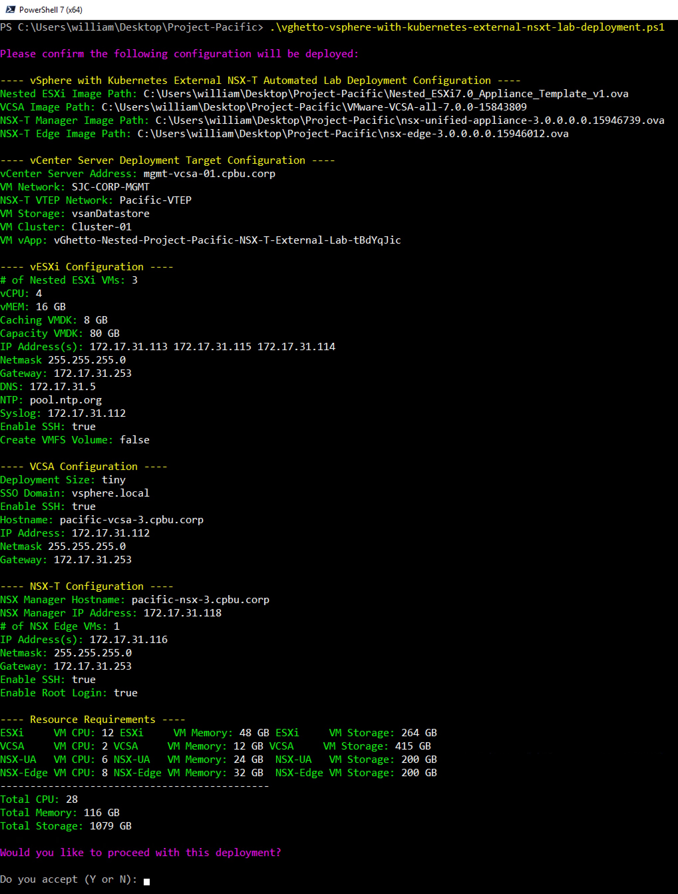

Here is an example output of a complete deployment:

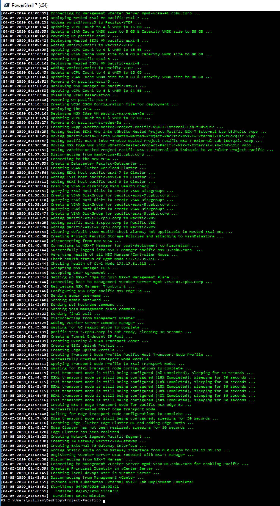

**Note:** Deployment time will vary based on underlying physical infrastructure resources. In my lab, this took ~40min to complete.

Once completed, you will end up with your deployed vSphere with Kubernetes Lab which is placed into a vApp

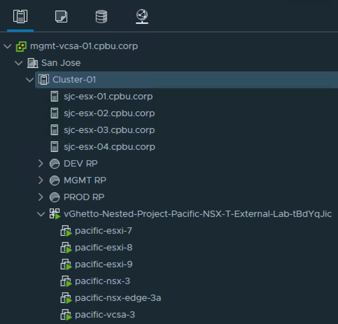

### Enable Workload Management

To consume the vSphere with Kubernetes capability in vSphere 7, you must enable workload management on a specific vSphere Cluster, which is currently not part of the automation script. The instructions below outline the steps and configuration values used in my example. For more details, please refer to the official VMware documentation [here](https://docs.vmware.com/en/VMware-vSphere/7.0/vmware-vsphere-with-kubernetes/GUID-21ABC792-0A23-40EF-8D37-0367B483585E.html).

Step 1 - Login to vSphere UI and click on `Menu->Workload Management` and click on the `Enable` button

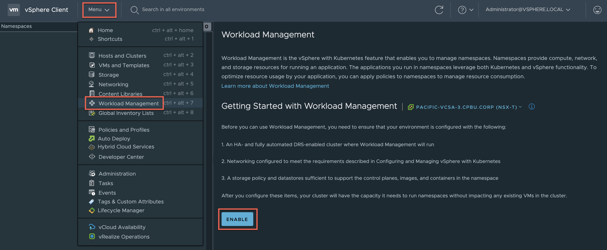

Step 2 - Select the `Workload Cluster` vSphere Cluster which should automatically show up in the Compatible list. If it does not, then it means something has gone wrong with either the selected configuration or there was an error durig deployment that you may have missed.

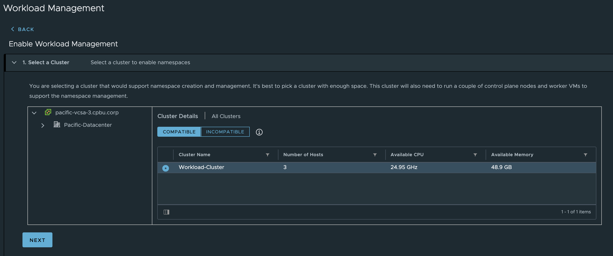

Step 3 - Select the Kubernetes Control Plane Size which you can use `Tiny`

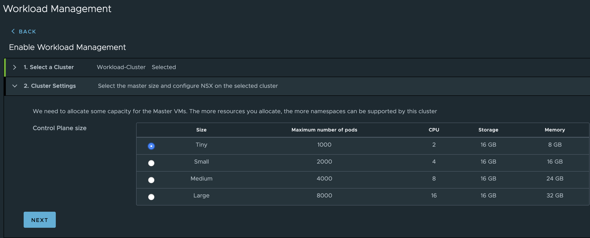

Step 4 - Configure the Management Network by selecting the `DVPG-Management-Network` distributed portgroup which is automatically created for you as part of the automation. Fill out the rest of the network configuration based on your enviornment

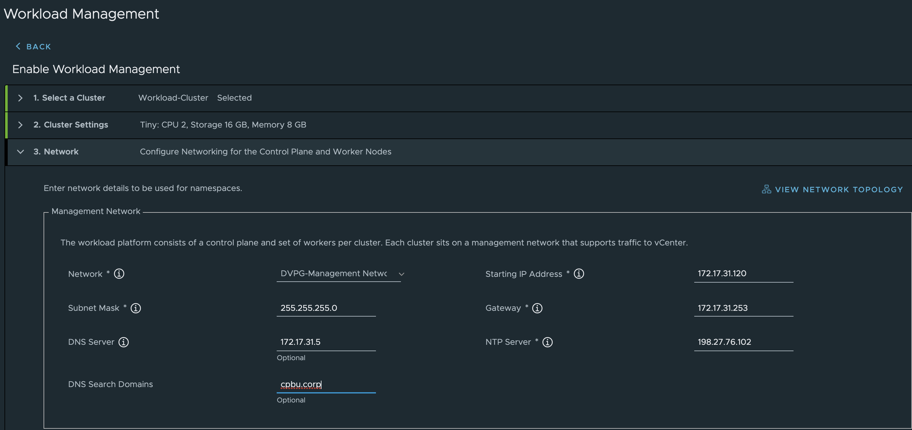

Step 5 - Configure the Workload Network by selecting the `Pacific-VDS` distributed virtual switch which is automatically created for you as part of the automation. After selecting a valid VDS, the Edge Cluster option should automatically populate with our NSX-T Edge Cluster called `Edge-Cluster-01`. Next, fill in your DNS server along with both the Ingress and Egress CIDR values (/27 network is required minimally or you can go larger)

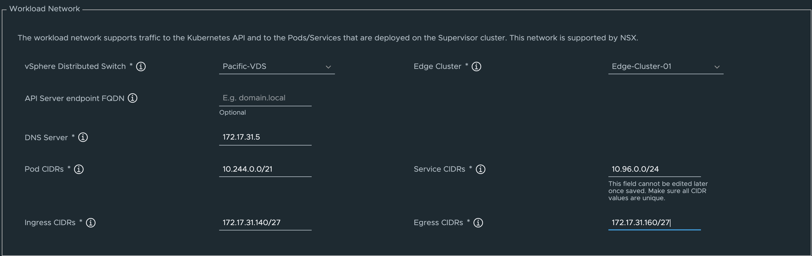

Step 6 - Configure the Storage policies by selecting the `pacific-gold-storage-policy` VM Storage Policy which is automatically created for you as part of the automation or any other VM Storage Policy you wish to use.

Step 7 - Finally, review workload management configuration and click `Finish` to begin the deployment.

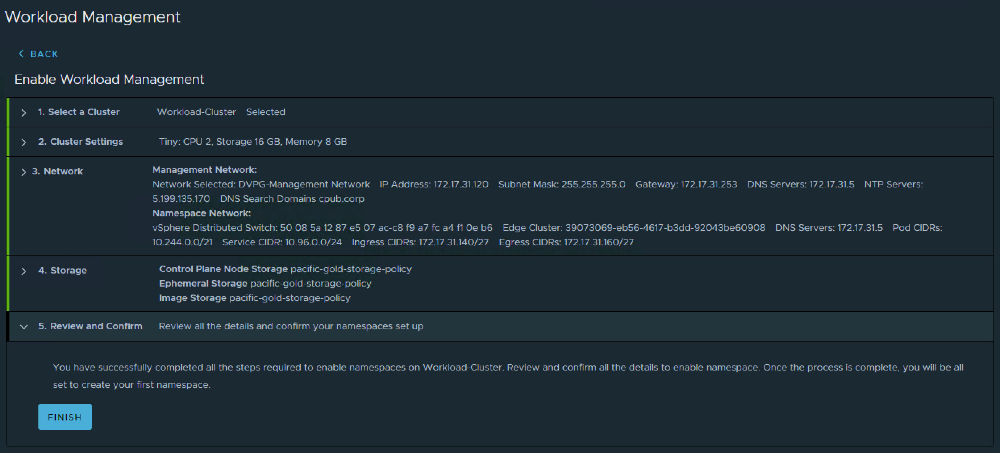

This will take some time depending on your environment and you will see various errors on the screen, that is expected. In my example, it took ~26 minutes to complete. You will know when it is completely done when you refreshed the workload management UI and you see a `Running` status along with an accessible Control PLane Node IP Address, in my case it is `172.17.31.129`

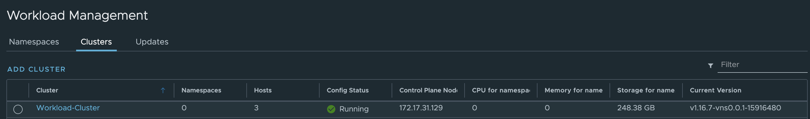

**Note:** In the future, I may look into automating this portion of the configuration to further accelerate the deployment. For now, it is recommended to get familiar with the concepts of vSphere with Kubernetes by going through the workflow manually so you understand what is happening.

### Create Namespace

Before we can deploy a workload into Supervisor Cluste which uses vSphere Pods, we need to first create a vSphere Namespace and assign a user and VM Storage Policy.

Step 1 - Under the `Namespaces` tab within the workload management UI, select the Supervisor Cluster (aka vSphere Cluster enabled with workload management) and provide a name.

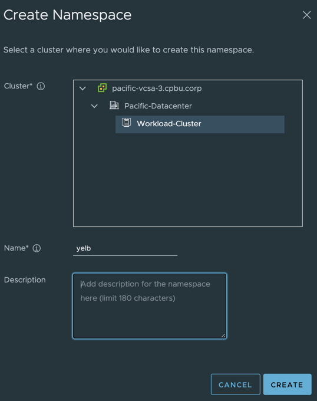

Step 2 - Click on `Add Permissions` to assign both the user `administrator@vsphere.local` and `devops@vsphere.local` which was automatically created by the Automation or any other valid user within vSphere to be able to deploy workloads and click on `Edit Storage` to assign the VM Storage Policy `pacific-gold-storage-policy` or any other valid VM Storage Policy.

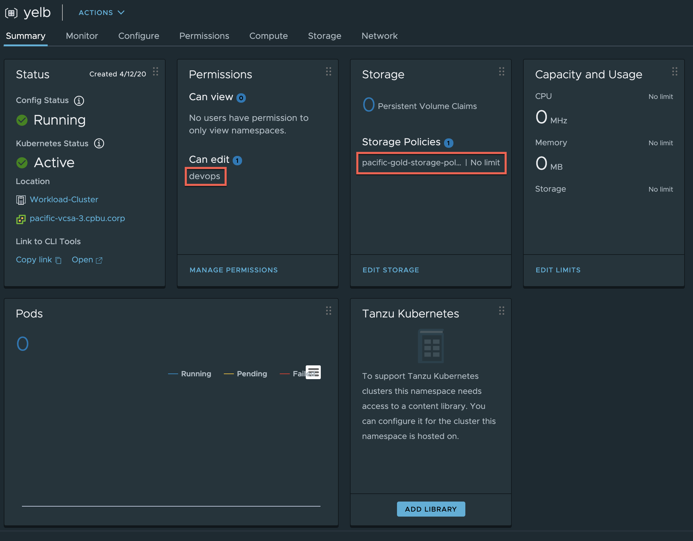

Step 3 - Finally click on the `Open` URL under the Namespace Status tile to download kubectl and vSphere plugin and extract that onto your desktop.

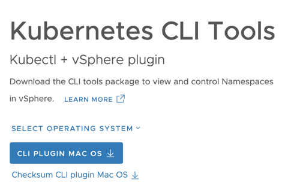

### Deploy Sample K8s Application

Step 1 - Login to Control Plane IP Address:

```console
./kubectl vsphere login --server=172.17.31.129 -u administrator@vsphere.local --insecure-skip-tls-verify
```

Step 2 - Change context into our `yelb` namespace:

```console
./kubectl config use-context yelb

Switched to context "yelb".
```

Step 3 - Create a file called `enable-all-policy.yaml` with the following content:

```console
apiVersion: networking.k8s.io/v1
kind: NetworkPolicy
metadata:
 name: allow-all
spec:
 podSelector: {}
 ingress:
 - {}
 egress:
 - {}
 policyTypes:
 - Ingress
 - Egress
```

Apply the policy by running the following:

```console
./kubectl apply -f enable-all-policy.yaml

networkpolicy.networking.k8s.io/allow-all created
```

Step 3 - Deploy our K8s Application called `Yelb`

```console
./kubectl apply -f https://raw.githubusercontent.com/lamw/vmware-k8s-app-demo/master/yelb-lb.yaml

service/redis-server created
service/yelb-db created
service/yelb-appserver created
service/yelb-ui created
deployment.apps/yelb-ui created
deployment.apps/redis-server created
deployment.apps/yelb-db created
deployment.apps/yelb-appserver created
```

Step 4 - Access the Yelb UI by retrieving the External Load Balancer IP Address provisioned by NSX-T and then open web browser to that IP Address

```console
./kubectl get service

NAME             TYPE           CLUSTER-IP    EXTERNAL-IP     PORT(S)        AGE
redis-server     ClusterIP      10.96.0.69    <none>          6379/TCP       43s
yelb-appserver   ClusterIP      10.96.0.48    <none>          4567/TCP       42s
yelb-db          ClusterIP      10.96.0.181   <none>          5432/TCP       43s
yelb-ui          LoadBalancer   10.96.0.75    172.17.31.130   80:31924/TCP   42s
```

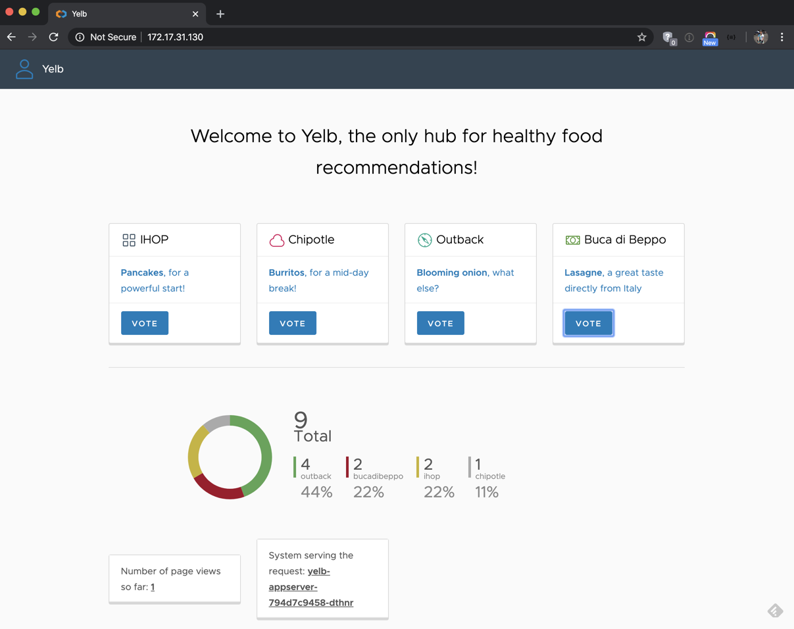

### Deploy Tanzu Kubernetes Cluster

Step 1 - Create a new subscribed vSphere Content Library pointing to `https://wp-content.vmware.com/v2/latest/lib.json` which contains the VMware Tanzu Kubernetes Grid (TKG) Images which must be sync'ed before you can deploy a TKG Cluster.


Step 2 - Navigate to the `Workload-Cluster` and under `Namespaces->General` click on `Add Library` to associate the vSphere Content Library we had just created in the previous step.

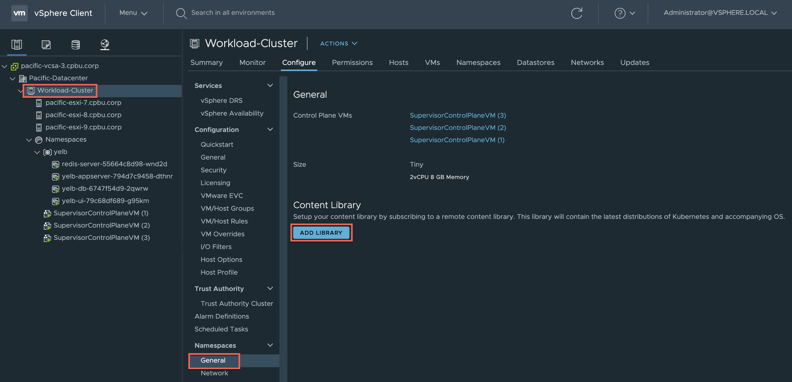

Step 3 - Create a file called `tkg-cluster.yaml` with the following content:

```console
apiVersion: run.tanzu.vmware.com/v1alpha1
kind: TanzuKubernetesCluster
metadata:
  name: tkg-cluster-1
  namespace: yelb
spec:
  distribution:
    version: v1.16.8
  topology:
    controlPlane:
      class: best-effort-xsmall
      count: 1
      storageClass: pacific-gold-storage-policy
    workers:
      class: best-effort-xsmall
      count: 3
      storageClass: pacific-gold-storage-policy
  settings:
    network:
      cni:
        name: calico
      services:
        cidrBlocks: ["198.51.100.0/12"]
      pods:
        cidrBlocks: ["192.0.2.0/16"]
```

Step 4 - Create TKG Cluster by running the following:

```console
./kubectl apply -f tkg-cluster.yaml

tanzukubernetescluster.run.tanzu.vmware.com/tkg-cluster-1 created
```

Step 5 - Login to TKG Cluster specifying by running the following:

```console
./kubectl vsphere login --server=172.17.31.129 -u administrator@vsphere.local --insecure-skip-tls-verify --tanzu-kubernetes-cluster-name tkg-cluster-1 --tanzu-kubernetes-cluster-namespace yelb
```

Step 6 - Verify the TKG Cluster is ready before use by running the following command:

```console
./kubectl get machine

NAME                                           PROVIDERID                                       PHASE
tkg-cluster-1-control-plane-2lnfb              vsphere://421465e7-bded-c92d-43ba-55e0a862b828   running
tkg-cluster-1-workers-p98cj-644dd658fd-4vtjj   vsphere://4214d30f-5fd8-eae5-7b1e-f28b8576f38e   provisioned
tkg-cluster-1-workers-p98cj-644dd658fd-bjmj5   vsphere://42141954-ecaf-dc15-544e-a7ef2b30b7e9   provisioned
tkg-cluster-1-workers-p98cj-644dd658fd-g6zxh   vsphere://4214d101-4ed0-97d3-aebc-0d0c3a7843cb   provisioned
```
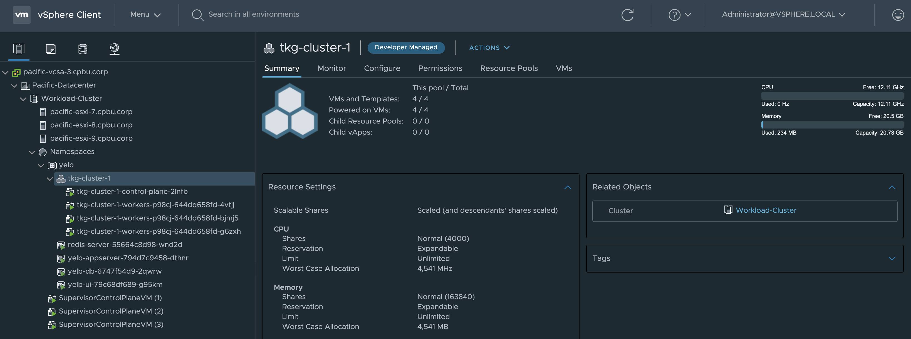

Step 7 - Change context into  `tkg-cluster-1` and you are now ready to deploy K8s apps into a TKG Cluster provisioned by vSphere with Kubernetes!

```console
./kubectl config use-context tkg-cluster-1
```

### Network Topology

Here is view into what the networking looks like (Network Topology tab in NSX-T UI) once this is fully configured and workloads are deployed.You can see where the T0 Static Route Address is being used to connect both vSphere Pods (icons on the left) and Tanzu Kubernetes Grid (TKG) Clusters (icons on the right).

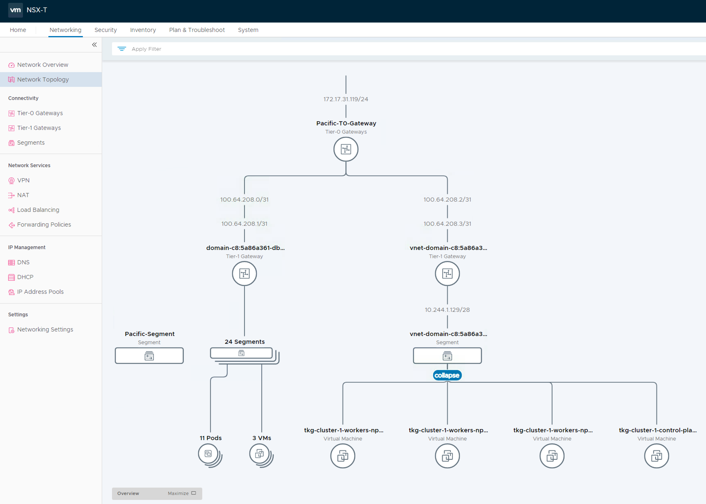

